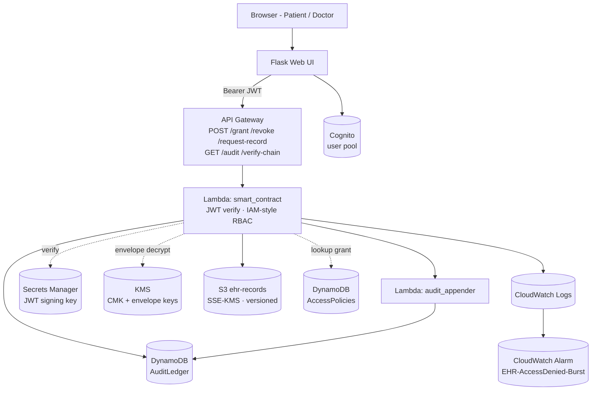

# Architecture (text version)

A rendered PNG can be exported from this Mermaid diagram. To regenerate:

```bash
npx -y @mermaid-js/mermaid-cli -i docs/architecture.md -o docs/architecture.png
```



## Data plane

1. **Patient login** — Flask -> Cognito `admin_initiate_auth`. On success, Flask
   pulls the HS512 signing key from **Secrets Manager** and mints a JWT with
   `{sub, role, exp}`.
2. **Grant** — Flask POSTs to **API Gateway** -> `smart_contract` Lambda -> writes
   to `AccessPolicies` -> appends `GRANT` block to `AuditLedger` ->
   emits CloudWatch log.
3. **Doctor fetch** — `smart_contract` Lambda checks `AccessPolicies`, calls
   `s3:GetObject`, calls `kms:Decrypt` to unwrap the data key, AES-GCM decrypts
   in memory, appends `RECORD_FETCH` block.
4. **Tamper attempt** — any direct DynamoDB edit changes a block's serialized
   form but not its stored hash; `verify_chain()` recomputes hashes in order
   and reports the broken `block_id`.

## Why every box is a cloud service

- Replacing any box with a "local" alternative (file, env var, in-process dict)
  weakens at least one row of the security ↔ cloud mapping.
- This is the design-level argument that responds to the proposal feedback.
